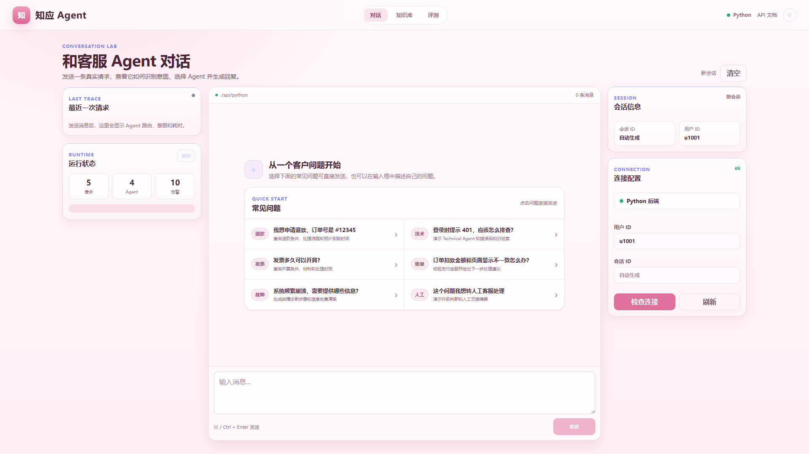
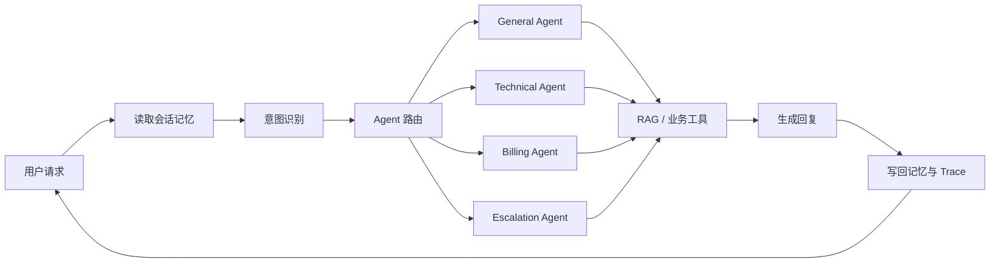

<div align="center">

# 知应 Agent

**基于多 Agent、RAG 与分层记忆的智能客服平台**

[](https://www.python.org/)
[](https://vuejs.org/)
[](https://fastapi.tiangolo.com/)
[](LICENSE)

</div>

知应 Agent（ZhiYing Agent）是一个面向中文客服场景的开源 Agent 应用。系统通过细粒度意图识别将请求路由给专业 Agent，由 Agent 按需调用 RAG 工具，并将路由、工具输入、耗时和知识引用呈现在可观测工作台中。

> 当前默认适配 DeepSeek 原生 OpenAI-compatible API。项目中的客服规则和知识内容均为演示数据，不连接真实订单、支付或工单系统。

## 效果展示



工作台包含对话、知识库管理和自动化评测三个视图。对话页可以同时查看意图、主 Agent、路由置信度、RAG 工具输入、响应耗时和运行告警。

## 核心能力

- **多 Agent 路由**：General、Technical、Billing、Escalation 四类专业 Agent。
- **细粒度意图识别**：融合 LLM、字符 n-gram 相似度和关键词规则，覆盖退款、发票、物流、登录故障等意图。
- **Agent Tool Use**：政策类和故障类问题可强制调用知识库，避免模型绕过数据源直接回答。
- **RAG 知识库**：支持文档添加、文件上传、切片、向量检索、查询改写、缓存与重排。
- **分层记忆**：Redis 保存会话工作记忆，ChromaDB 保存情景记忆和用户画像。
- **可观测链路**：记录请求 ID、路由结果、工具输入、缓存状态、重排状态和耗时。
- **自动化评测**：提供意图识别评测、LLM-as-Judge 回复评测和回归基线。
- **动态 Skills**：业务规则以 Markdown Skill 维护，运行时按 Agent 注入。

## 请求链路



| Agent | 主要职责 | 示例问题 |
|---|---|---|
| GeneralAgent | 通用咨询、订单与物流分诊 | “订单什么时候发货？” |
| TechnicalAgent | 登录、错误码和系统故障排查 | “登录一直提示 401” |
| BillingAgent | 退款、发票、支付与扣款 | “我要申请退款” |
| EscalationAgent | 人工升级和交接摘要 | “请转人工客服” |

复合问题可以并行派发给多个 Agent，再由 `ResponseComposer` 合并为一条统一回复。更完整的设计说明见 [架构文档](docs/architecture.md)。

## Agent 评测集

公开评测数据位于 `backend/evaluation/datasets/`：

- `intent_cases.json`：120 条中文意图分类样本，覆盖 12 个核心类别，每类 10 条。
- `dialog_cases.json`：20 组单轮和多轮对话样本，其中包含退款、发票、物流、支付异常、登录故障和复合问题。

运行 `POST /eval/run` 时默认加载这两份数据。意图评测输出 Accuracy、Macro-F1 和分类型结果；对话评测由 LLM-as-Judge 输出相关性、准确性、完整性、可执行性和综合得分，并与历史 baseline 做回归比较。数据集是可扩展的 JSON 格式，也可以通过接口提交自定义用例。

## 技术栈

- 后端：Python、FastAPI、Anthropic SDK、OpenAI SDK
- 模型：DeepSeek 原生 API（可切换 Anthropic-compatible 客户端）
- 数据：Redis、ChromaDB
- 前端：Vue 3、Vite
- 监控：Prometheus Client、自定义运行告警
- 工程化：Pytest、GitHub Actions、Docker Compose

## 本地启动

### 1. 环境要求

- Python 3.11+
- Node.js 22+
- Redis 7（短期记忆需要）
- DeepSeek API Key

ChromaDB 服务不是本地启动的硬性要求：连接失败时，后端会回退到本地持久化模式。首次使用本地模式时可能下载默认向量模型。

### 2. 启动后端

```powershell
cd backend
Copy-Item .env.example .env
```

编辑 `backend/.env`，至少填写：

```env
LLM_API_KEY=your_deepseek_api_key
LLM_MODEL=deepseek-v4-pro
LLM_BASE_URL=https://api.deepseek.com
LLM_PROVIDER=deepseek_openai
DEEPSEEK_THINKING=disabled
```

安装依赖并启动：

```powershell
conda create -n zhiying python=3.11 -y
conda activate zhiying
pip install -r requirements-dev.txt
python -m uvicorn api.main:app --reload --port 8000
```

健康检查：

```powershell
Invoke-RestMethod http://127.0.0.1:8000/health
```

### 3. 启动前端

打开另一个终端：

```powershell
cd frontend
npm install
npm run dev
```

访问：

- 前端工作台：<http://127.0.0.1:5173>
- Swagger API：<http://127.0.0.1:8000/docs>

### 4. 导入示例知识

后端启动后，可以导入仓库内的公开演示知识：

```powershell
Invoke-RestMethod `
  -Method Post `
  -Uri http://127.0.0.1:8000/knowledge/add `
  -ContentType 'application/json; charset=utf-8' `
  -InFile ./backend/examples/knowledge.json
```

## Docker Compose

复制并填写配置：

```bash
cp backend/.env.example backend/.env
docker compose up --build
```

启动后访问 `http://localhost:5173`。Compose 会同时启动前端、后端、Redis 和 ChromaDB。

## API 示例

```bash
curl -X POST http://127.0.0.1:8000/chat \
  -H "Content-Type: application/json" \
  -d '{"message":"我想申请退款，订单号是 #12345","user_id":"demo-user"}'
```

主要接口：

| 方法 | 路径 | 说明 |
|---|---|---|
| `POST` | `/chat` | 对话、意图识别、Agent 路由和工具调用 |
| `POST` | `/search` | 直接测试知识检索链路 |
| `POST` | `/knowledge/add` | 批量添加知识文档 |
| `POST` | `/knowledge/upload` | 上传 JSON、Markdown 或文本文件 |
| `GET` | `/knowledge/stats` | 查看知识库统计 |
| `GET` | `/trace/tool/{request_id}` | 查看单次工具调用 Trace |
| `GET` | `/monitor` | 查看 Agent 和工具运行指标 |
| `POST` | `/eval/run` | 执行端到端评测 |
| `GET` | `/skills` | 查看已加载的 Skills |

## 测试与构建

```bash
cd backend
python -m pytest -q

cd ../frontend
npm ci
npm run build
```

## 项目结构

```text
ZhiYing-Agent/
├── backend/
│   ├── agents/          # Agent 定义、路由与工具循环
│   ├── api/             # FastAPI 接口
│   ├── core/            # 意图识别、LLM 适配与 Skills
│   ├── mcp/             # 工具管理和 RAG 知识库
│   ├── memory/          # Redis + ChromaDB 分层记忆
│   ├── monitor/         # 指标和告警
│   ├── evaluation/      # 自动化评测
│   │   └── datasets/     # 公开意图与对话评测集
│   ├── skills/          # 可动态加载的业务规则
│   ├── examples/        # 可公开导入的演示知识
│   └── tests/
├── frontend/            # Vue 3 可观测工作台
├── docs/                # 架构文档和效果图
└── docker-compose.yml
```

## 安全说明

- 不要提交 `backend/.env`、API Key、Cookie、真实用户数据或本地数据库。
- `user_id` 默认不被视为可信身份；未认证访客使用服务端签发的独立 Cookie。
- 生产环境请配置 `ZHIYING_API_KEY`、`ZHIYING_USER_ID_SECRET`、HTTPS 和受保护的 Redis/ChromaDB。
- 演示规则不应直接用于真实退款、支付或账户操作。

## License

本项目使用 [MIT License](LICENSE)。
