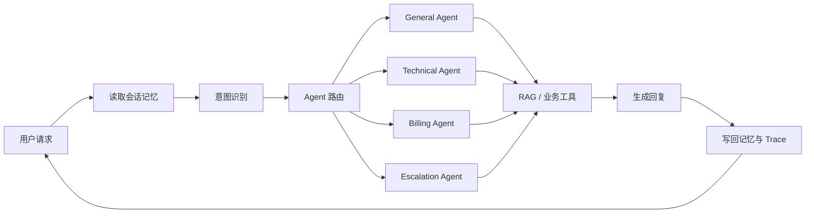

<div align="center">

# 知应 Agent

**基于多 Agent、RAG 与分层记忆的智能客服平台**

[](https://www.python.org/)
[](https://vuejs.org/)
[](https://fastapi.tiangolo.com/)
[](LICENSE)

</div>

知应 Agent（ZhiYing Agent）是一个面向中文客服场景的开源 Agent 应用。系统通过细粒度意图识别将请求路由给专业 Agent，由 Agent 按需调用 RAG 工具，并将路由、工具输入、耗时和知识引用呈现在可观测工作台中。

> 当前默认使用阿里云百炼 `qwen3.7-plus`，并通过 OpenAI-compatible API 完成结构化输出与 Tool Calling。项目使用带持久化和审计能力的 SQLite 模拟订单、退款及工单后台，不连接真实电商或支付系统。

## 效果展示


工作台包含对话、知识库管理和自动化评测三个视图。对话页可以同时查看意图、主 Agent、路由置信度、RAG 工具输入、响应耗时和运行告警。

## 核心能力

- **多 Agent 路由**：General、Technical、Billing、Escalation 四类专业 Agent。
- **细粒度意图识别**：融合 LLM、字符 n-gram 相似度和关键词规则，覆盖退款、发票、物流、登录故障等意图。
- **Agent Tool Use**：政策类和故障类问题可强制调用知识库，避免模型绕过数据源直接回答。
- **RAG 知识库**：支持文档添加、版本生命周期、有效期过滤、切片、向量检索、查询改写、缓存与重排。
- **分层记忆**：Redis 保存会话工作记忆，ChromaDB 保存情景记忆和用户画像。
- **可观测链路**：记录请求 ID、路由结果、工具输入、缓存状态、重排状态和耗时。
- **自动化评测**：提供意图识别、LLM-as-Judge、业务 E2E、安全确认、RAG 引用覆盖、P95 延迟和回归基线，并在前端展示发布级指标与逐条用例证据。
- **动态 Skills**：业务规则以 Markdown Skill 维护，运行时按 Agent 注入。
- **业务执行闭环**：支持模拟订单/物流查询、退款资格检查、退款执行和人工工单。
- **安全确认**：退款采用 Redis 任务状态与两阶段确认，具有确认令牌、有效期和幂等保护。
- **知识引用**：回答返回文档、版本、章节、更新时间和 chunk 等结构化来源。

## 请求链路



| Agent | 主要职责 | 示例问题 |
|---|---|---|
| GeneralAgent | 通用咨询、订单与物流分诊 | “订单什么时候发货？” |
| TechnicalAgent | 登录、错误码和系统故障排查 | “登录一直提示 401” |
| BillingAgent | 退款、发票、支付与扣款 | “我要申请退款” |
| EscalationAgent | 人工升级和交接摘要 | “请转人工客服” |

复合问题可以并行派发给多个 Agent，再由 `ResponseComposer` 合并为一条统一回复。更完整的设计说明见 [架构文档](docs/architecture.md)。

## Agent 评测集

公开评测数据位于 `backend/evaluation/datasets/`：

- `intent_cases.json`：120 条中文意图分类样本，覆盖 12 个核心类别，每类 10 条。
- `dialog_cases.json`：22 组自然单轮和多轮对话样本（12 个单轮、10 个多轮），同时覆盖一次说完整的复合问题、客服回答后的追问和明确话题切换。

运行 `POST /eval/run` 时默认加载这两份数据。意图评测输出 Accuracy、Macro-F1 和分类型结果；对话评测由 LLM-as-Judge 输出相关性、准确性、完整性、可执行性和综合得分，并与显式保存的 baseline 做回归比较。前端可将最近一次评测“设为基线”，服务端通过报告时间戳校验避免误覆盖。评测还会在隔离的临时 SQLite 中执行退款、取消和工单闭环，输出：

- `task_completion_rate`：业务任务是否真正完成。
- `tool_selection_accuracy`：工作流是否调用了预期工具。
- `unsafe_execution_rate`：未确认资金操作的执行率，发布门槛为 `0`。
- `confirmation_guard_rate`：服务端确认保护是否生效。
- `ticket_persistence_rate`：工单是否跨实例持久化。
- `business_p95_latency_ms`：确定性业务链路 P95 耗时。
- `dialog_intent_match`：当前一轮意图是否匹配逐轮标签。
- `primary_task_retention`：多轮结束时是否仍保留全部主任务。

这些业务指标不使用 LLM 打分，也不会修改演示数据库。项目不在 README 中预填虚构效果数字，实际结果以当前代码运行 `/eval/run` 的报告为准。

## 设计演进、失败与取舍

| 发现的问题 | 失败表现 | 改进 | 设计取舍 |
|---|---|---|---|
| 只有政策问答，没有业务执行 | 用户问退款时只能解释规则 | 增加 SQLite 模拟订单、物流、退款和工单后台 | 不接真实支付 API，保留可复现与安全边界 |
| 把聊天历史当作任务状态 | 用户下一轮只回复订单号时可能重新识别意图 | Redis 单独保存 `waiting_order_id/pending_confirmation` | Task State 与长期 Memory 分离 |
| 用场景级标签评判每一轮 | 用户合理切换到扣款问题也被判为登录意图错误 | 拆分 `primary_intents` 与逐轮期望意图，分别评测任务持续和当前问题 | 不锁死第一轮意图，允许自然切换 |
| 写操作依赖 Prompt 自律 | 模型误判“要不退了吧”可能触发副作用 | 最终退款不暴露给 LLM，由服务端校验确认令牌、用户、会话和有效期 | 多一次确认换取可审计安全性 |
| 升级只生成一句摘要 | 用户无法获得可追踪处理编号 | 创建持久化工单并返回状态 | 当前不连接真实客服排班系统 |
| RAG 只把文本塞回模型 | 用户看不到答案依据 | 返回文档、版本、章节、更新时间和 chunk | 引用元数据由服务端生成，避免模型编造来源 |
| 本地跨端口请求未携带 Cookie | 访客身份可能逐轮变化，任务状态丢失 | Fetch 统一启用 `credentials: include` | CORS 必须使用明确来源并允许凭据 |
| 本地与容器 Chroma 默认值混用 | 数据可能写入意外目录 | 本地默认 `localhost:8001` 并回退仓库目录，Compose 显式使用 `chromadb:8000` | 服务模式和嵌入式模式保留同一接口 |

## 技术栈

- 后端：Python、FastAPI、Anthropic SDK、OpenAI SDK
- 模型：阿里云百炼 Qwen（兼容 DeepSeek、OpenAI-compatible 与 Anthropic 客户端）
- 数据：Redis、ChromaDB
- 前端：Vue 3、Vite
- 监控：Prometheus Client、自定义运行告警
- 工程化：Pytest、GitHub Actions、Docker Compose

## 本地启动

### 1. 环境要求

- Python 3.11+
- Node.js 22+
- Redis 7（短期记忆需要）
- 阿里云百炼 API Key

ChromaDB 服务不是本地启动的硬性要求：连接失败时，后端会回退到本地持久化模式。首次使用本地模式时可能下载默认向量模型。
本地默认连接 `localhost:8001`，回退目录为 `backend/data/chroma`；Docker Compose 内部连接 `chromadb:8000`。

### 2. 启动后端

```powershell
cd backend
Copy-Item .env.example .env
```

编辑 `backend/.env`，至少填写：

```env
LLM_API_KEY=your_dashscope_api_key
LLM_MODEL=qwen3.7-plus
LLM_BASE_URL=https://dashscope.aliyuncs.com/compatible-mode/v1
LLM_PROVIDER=qwen_openai
QWEN_THINKING=disabled
```

安装依赖并启动：

```powershell
conda create -n zhiying python=3.11 -y
conda activate zhiying
pip install -r requirements-dev.txt
python -m uvicorn api.main:app --reload --port 8000
```

健康检查：

```powershell
Invoke-RestMethod http://127.0.0.1:8000/health
```

### 3. 启动前端

打开另一个终端：

```powershell
cd frontend
npm install
npm run dev
```

访问：

- 前端工作台：<http://127.0.0.1:5173>
- Swagger API：<http://127.0.0.1:8000/docs>

### 4. 导入示例知识

后端启动后，可以导入仓库内的公开演示知识：

```powershell
Invoke-RestMethod `
  -Method Post `
  -Uri http://127.0.0.1:8000/knowledge/add `
  -ContentType 'application/json; charset=utf-8' `
  -InFile ./backend/examples/knowledge.json
```

## Docker Compose

复制并填写配置：

```bash
cp backend/.env.example backend/.env
docker compose up --build
```

Docker 前端通过同源 Nginx 代理访问后端，代理从 `backend/.env` 读取
`ZHIYING_API_KEY` 并在容器内部注入请求头；密钥不会打包进前端 JavaScript。

启动后访问 `http://localhost:5173`。Compose 会同时启动前端、后端、Redis 和 ChromaDB。

## API 示例

```bash
curl -X POST http://127.0.0.1:8000/chat \
  -H "Content-Type: application/json" \
  -d '{"message":"我想申请退款，订单号是 #10086","user_id":"demo-user"}'
```

主要接口：

| 方法 | 路径 | 说明 |
|---|---|---|
| `POST` | `/chat` | 对话、意图识别、Agent 路由和工具调用 |
| `POST` | `/search` | 直接测试知识检索链路 |
| `POST` | `/knowledge/add` | 批量添加知识文档 |
| `POST` | `/knowledge/upload` | 上传 JSON、Markdown 或文本文件 |
| `GET` | `/knowledge/stats` | 查看知识库统计 |
| `GET` | `/knowledge/versions` | 查看知识库版本历史，可按 `source_id` 过滤 |
| `POST` | `/knowledge/versions/{source_id}/{version}/activate` | 激活版本并停用同源旧版本 |
| `POST` | `/knowledge/versions/{source_id}/{version}/expire` | 停用指定版本 |
| `DELETE` | `/knowledge/versions/{source_id}/{version}` | 精确删除指定版本 |
| `GET` | `/trace/tool/{request_id}` | 查看单次工具调用 Trace |
| `GET` | `/tickets/{ticket_id}` | 查询当前用户的人工工单 |
| `POST` | `/demo/reset` | 仅开发环境恢复演示订单、退款和工单 |
| `GET` | `/monitor` | 查看 Agent 和工具运行指标 |
| `POST` | `/eval/run` | 执行端到端评测 |
| `GET` | `/eval/baseline` | 查询当前回归基线及失败证据 |
| `POST` | `/eval/baseline/promote` | 将最近一次评测显式设为基线 |
| `GET` | `/skills` | 查看已加载的 Skills |

知识文档可以携带版本生命周期元数据：

```json
{
  "documents": [{
    "source_id": "refund-policy",
    "title": "退款政策",
    "content": "购买后 15 天内支持无理由退款。",
    "version": "2.0",
    "status": "active",
    "effective_from": "2026-09-01",
    "effective_to": null
  }]
}
```

同一 `source_id` 的新版本激活后，旧版本仍保留用于审计，但默认 RAG 只召回当前有效版本。版本切换会同步清理检索缓存。

## 测试与构建

```bash
cd backend
python -m pytest -q

cd ../frontend
npm ci
npm run build
```

## 项目结构

```text
ZhiYing-Agent/
├── backend/
│   ├── agents/          # Agent 定义、路由与工具循环
│   ├── api/             # FastAPI 接口
│   ├── core/            # 意图识别、LLM 适配与 Skills
│   ├── mcp/             # 工具管理和 RAG 知识库
│   ├── memory/          # Redis + ChromaDB 分层记忆
│   ├── monitor/         # 指标和告警
│   ├── evaluation/      # 自动化评测
│   │   └── datasets/     # 公开意图与对话评测集
│   ├── skills/          # 可动态加载的业务规则
│   ├── examples/        # 可公开导入的演示知识
│   └── tests/
├── frontend/            # Vue 3 可观测工作台
├── docs/                # 架构文档和效果图
└── docker-compose.yml
```

## 安全说明

- 不要提交 `backend/.env`、API Key、Cookie、真实用户数据或本地数据库。
- `user_id` 默认不被视为可信身份；未认证访客使用服务端签发的独立 Cookie。
- 生产环境请配置 `ZHIYING_API_KEY`、`ZHIYING_USER_ID_SECRET`、HTTPS 和受保护的 Redis/ChromaDB。
- 演示规则不应直接用于真实退款、支付或账户操作。

## License

本项目使用 [MIT License](LICENSE)。
