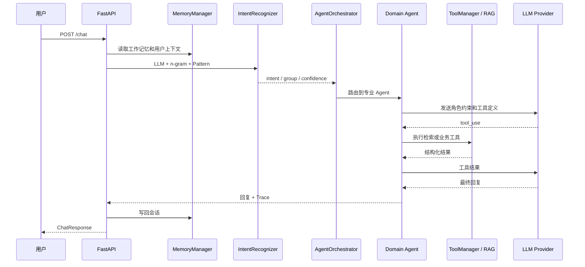

# 架构说明

知应 Agent 将“理解问题、选择处理角色、调用外部知识、生成回复和记录执行过程”拆成独立组件，以便替换模型、知识库或业务工具时不影响整条链路。

## 对话链路

## Agent 边界

- `GeneralAgent`：通用接待、订单物流和首轮信息澄清。
- `TechnicalAgent`：登录认证、错误码、崩溃和接口故障。
- `BillingAgent`：退款、发票、支付、订阅和金额争议。
- `EscalationAgent`：人工升级、优先级标记和交接摘要。
- `ResponseComposer`：仅在多 Agent 并行场景中合并结果，不作为独立业务入口。

Agent 只能调用其白名单中的工具。对于退款、发票、支付和技术故障等事实型意图，首轮会强制调用 `search_knowledge_base`，防止模型在没有业务依据时直接生成政策结论。

编排器同时区分“Agent 类型”和“业务目标”。`TaskIntentTracker` 将当前轮明确出现的目标写入 `explicit_intents`；当一轮包含多个目标时，编排器按目标创建隔离的子任务状态并逐项执行。这样“退款 + 发票”即使都由 `BillingAgent` 处理，也不会因为按 Agent 类型去重或退款状态机提前返回而遗漏其中一项。历史目标只保存在 `primary_intents` 中，不会在后续每一轮被重复执行。

## 意图识别

`IntentRecognizer` 并行执行三类策略：

1. LLM 语义分类，用于理解上下文和复杂表达。
2. 本地字符 n-gram 向量匹配，用作无 Embedding 服务时的稳定兜底。
3. 关键词模式匹配，用于识别发票、退款、401 等明确业务信号。

三路结果经过加权投票输出细粒度意图、意图组、置信度、紧急程度和结构化实体。

## LLM 适配

项目内部保留 Anthropic Messages 风格的工具循环，由 `core/llm_client.py` 负责转换为 DeepSeek 原生 OpenAI-compatible 请求：

- 消息与 system prompt 转换
- Tool schema 和 `tool_choice` 转换
- Tool call 结果回传
- 响应内容转换回内部统一结构

DeepSeek Thinking Mode 默认关闭，因为当前链路会对事实型意图强制指定工具。若启用 Thinking Mode，需要同时实现 `reasoning_content` 的完整回传。

## 记忆与知识库

- Redis：保存当前会话的短期工作记忆。
- ChromaDB 情景记忆：保存认证用户的历史事件摘要。
- ChromaDB 用户画像：保存可复用的偏好和稳定信息。
- ChromaDB RAG Collection：保存业务知识片段，与用户记忆隔离。

访客身份由服务端 Cookie 隔离；默认只使用短期记忆。认证用户需要由上游网关提供签名身份头。

## 可观测与评测

仓库提供一套可直接运行的公开评测集：120 条意图分类样本和 20 组单轮/多轮对话样本，分别位于 `backend/evaluation/datasets/intent_cases.json` 与 `dialog_cases.json`。新增样本只需按现有 JSON 字段追加，不需要修改评测代码。

每次请求生成 `request_id`，Trace 记录：

- 意图和主 Agent
- 路由原因及置信度
- 尝试和成功调用的工具
- 工具输入、耗时、缓存和重排状态
- 是否使用知识库、是否升级人工

评测模块支持意图准确率、回复质量评分和回归基线。生产环境默认不会自动覆盖基线。
